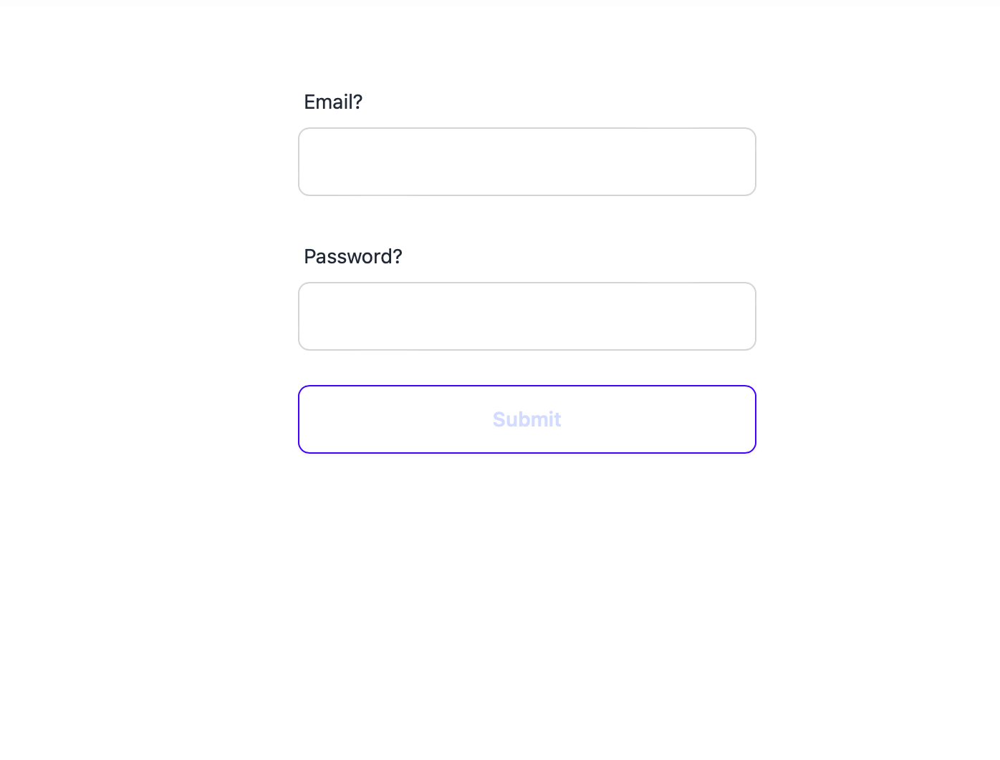
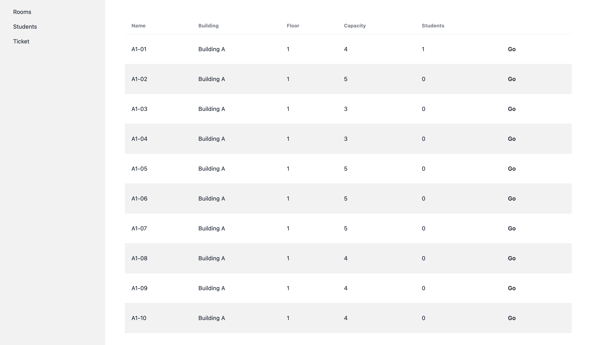
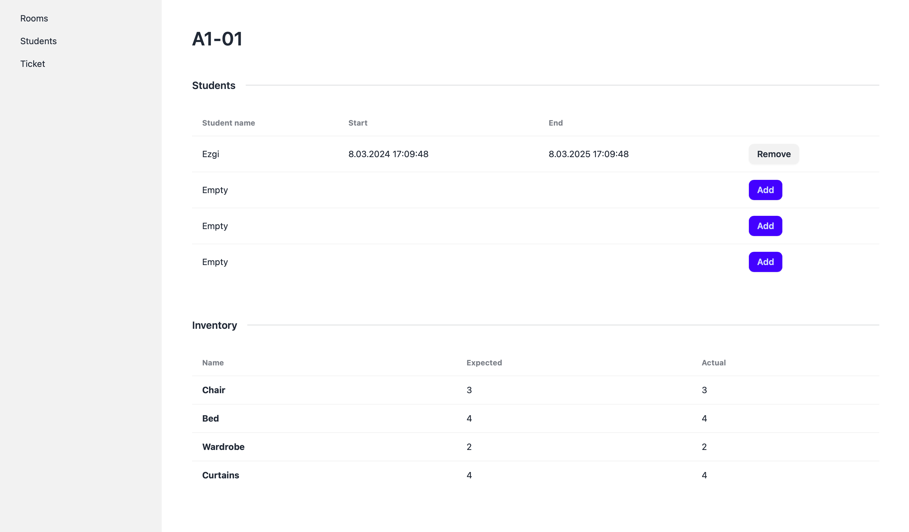
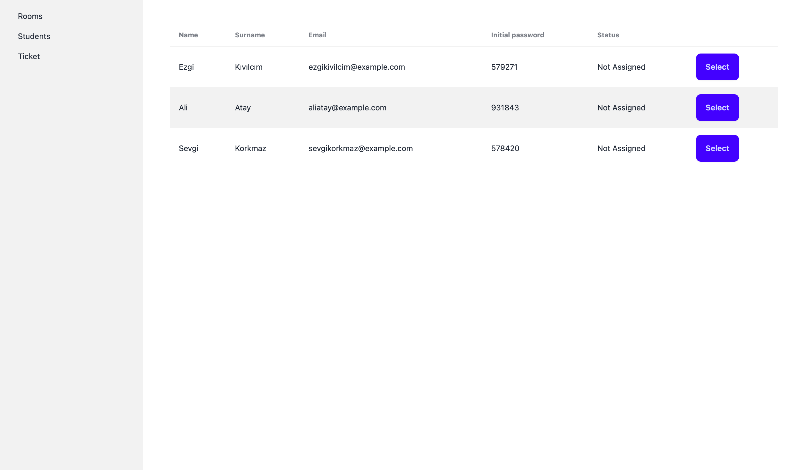
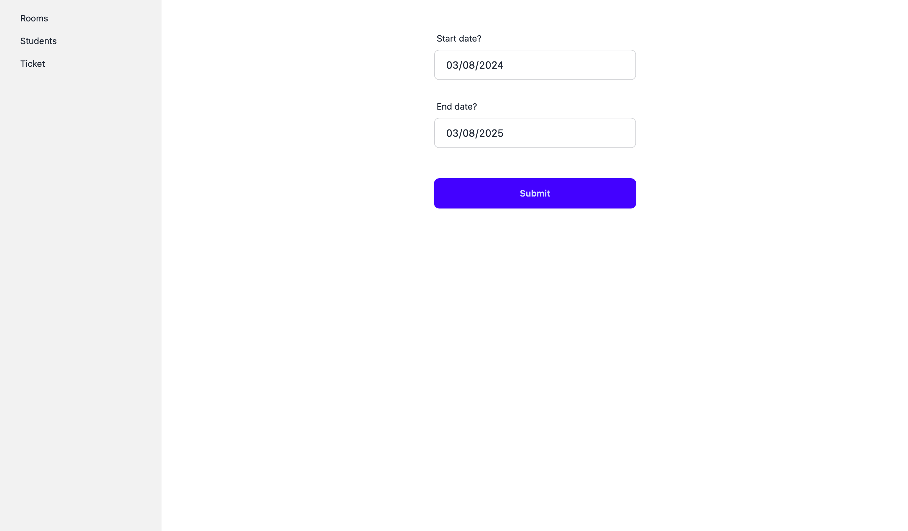
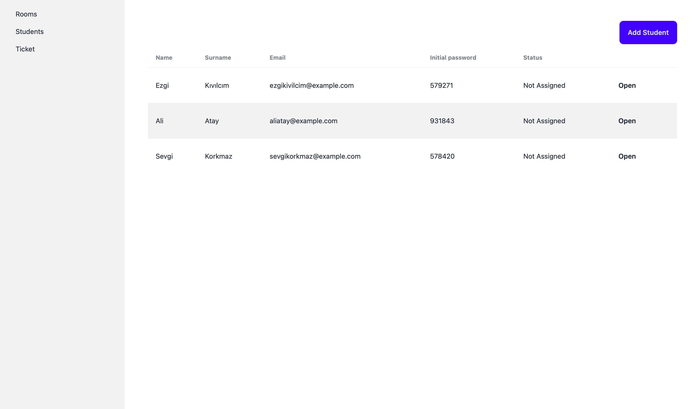
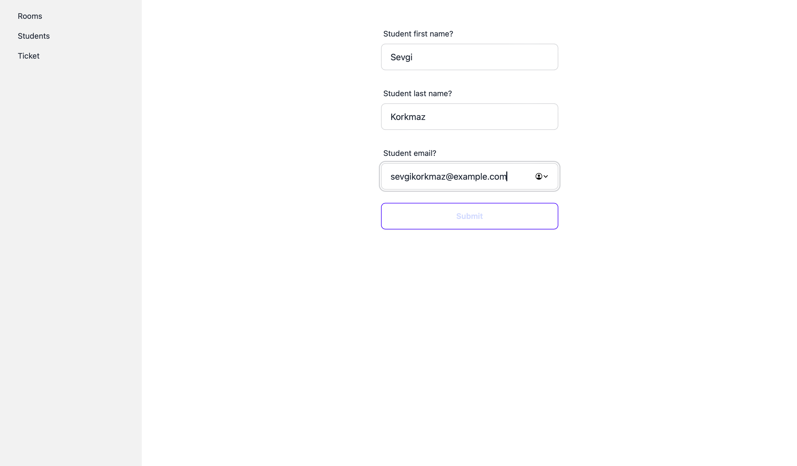
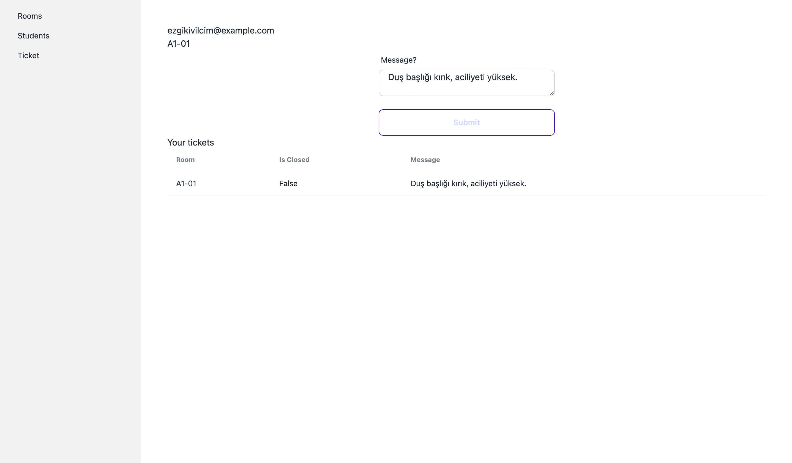
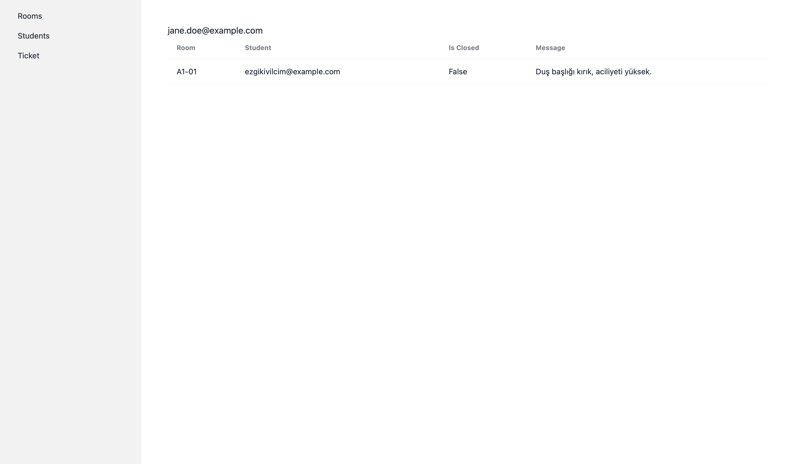

# Dormitory Management System

## DESCRIPTION

The Dormitory Management System is a web application I built to make dormitory management smoother and more organized. It gives administrators a single place to oversee room assignments, student details, and inventory, while also offering students a way to quickly report any problems. This speeds up communication and solves issues faster than the old methods. I developed this system using .NET 8.0 and Blazor, and it uses a PostgreSQL database for solid data handling and to provide a smooth experience for users.

### Frontend Development

For the design of my Dormitory Management System, I chose Tailwind CSS. It's a tool that helps me make my website look good easily and quickly. Tailwind gave me lots of ready-made design pieces that I could put together to make my site work well on computers, tablets, and phones.

I picked Tailwind because it's a modern tool that makes building websites faster and lets us easily make changes whenever we need to.

## Features

- **Authentication System**: Secure login for administrators and students.
- **Room Management**: Administrators can add, remove, or modify room details.
- **Student Management**: Keep track of student details and room assignments.
- **Maintenance Tickets**: Students can report issues, which admins can manage and resolve.
- **Inventory Management**: Track and manage dormitory assets and supplies.

### Prerequisites

- .NET 8.0 SDK
- PostgreSQL
- Any modern web browser

### Installation

```bash
git clone https://github.com/mbrraus/dormitory-management-system.git
cd dormitory-management-system
dotnet restore
dotnet run
```
## Screenshots

## Authentication and Security



The Dormitory Management System is secured by a role-based authentication mechanism. When users navigate to the login page, as shown in the screenshot, they're requested to input their credentials. The authentication process then proceeds in the following manner:

1. **Role Determination**: Before verifying the credentials, the system identifies the role associated with the entered email. This pre-verification step allows the system to determine the level of access and the relevant user interface to present upon successful authentication.

2. **Credential Verification**: Once the user's role determined, the system moves to verify the provided credentials. Here's where the use of hashed passwords becomes essential. Instead of storing passwords in plain text, which could be easily read by anyone with access to the database, we store a hashed version created by a cryptographic algorithm. This hash is compared against the hash stored in the database. If they match, it confirms the user's identity and grants access.

3. **Access Control**: The user's journey within the system is defined by their role. Administrators have a broad range of privileges that allow them to manage the dormitory's operations comprehensively. This includes accessing student lists, room details, adding students, assigning students and maintenance requests. Students, on the other hand, can easily submit requests for room repairs and follow up on the status of their requests.

The system smartly identifies whether a user is an administrator or a student right from the start, ensuring that each person encounters a secure environment that’s cut out for their role.

### Rooms Overview

*Figure: Rooms Overview — An admin-viewable list of rooms with details such as building, floor, capacity, and current occupancy. After clicking the 'Go' button, it navigates to the room details page.*

### Detailed Room View

*Figure: Detailed Room View — Displays specific room information, including the list of assigned students and room inventory.*

### Room Assignment


*Figure: Room Assignment — Where administrators can assign and manage students in their respective rooms.*

### Student List

*Figure: Student List — Administrators can view and manage student details, including room status.*

### Student Registration Form

*Figure: Student Registration Form — After successful registration, an initial password is assigned to each student.*

### Ticket Submission


### Ticket View - Admin Panel



